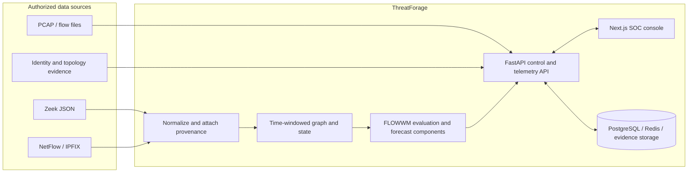

<div align="center">

# 🛡️ ThreatForage

### Predict network risk over time. Give analysts evidence they can inspect.

<p>
  
  
  
  
  
  
</p>

**An open-source research prototype for temporal network-attack forecasting and security-analyst decision support.**

[Get started](#-quick-start) · [Architecture](#-how-it-fits-together) · [Live telemetry](#-live-telemetry) · [Security boundary](#-important-limitations)

</div>

---

## Why ThreatForage?

An intrusion unfolds over time. ThreatForage explores whether sequences of network activity can provide earlier, more interpretable risk signals than treating each flow as an isolated benign/malicious classification.

```text
flows + packets + context  →  time-windowed network states  →  future risk and stage hypotheses
```

The operator console brings investigation, topology, forecasts, evidence, and model evaluation into one place. Predictions are advisory; operators retain control of response actions.

## ✨ What you can explore

| Workspace | Purpose |
|---|---|
| **Command Center** | Review incidents, asset context, and the current network picture. |
| **Passive Analysis** | Inspect PCAP/PCAPNG and supported flow data without interacting with the source network. |
| **Live Telemetry** | View collector status, normalized records, source provenance, and trusted graph readiness. |
| **Graph Analysis & topology** | Explore observed network relationships and model-generated graph context. |
| **Forecast & intelligence** | Review risk/stage forecasts, explanations, novelty signals, and threat context. |
| **Model Lab** | Examine training/evaluation artifacts and benchmark results. |
| **Demo-2** | Run a separate LAN cyber-range demonstration with role-based joining and simulated attacker progression. |

> **Demo-2 is a cyber-range simulation.** Its events and heartbeats are not production packet telemetry or evidence of real attacks.

## 🧠 How it fits together



### Technology at a glance

| Area | Stack |
|---|---|
| Web | Next.js, React, TypeScript, Tailwind CSS, Zustand |
| API | FastAPI, Pydantic, SQLAlchemy, WebSockets |
| ML | PyTorch, temporal network-state modelling, calibration/evaluation tooling |
| Storage & observability | PostgreSQL, Redis, MinIO, Prometheus, Grafana, Loki |
| Telemetry inputs | Zeek JSON, PCAP/PCAPNG, flow CSV, optional NetFlow/IPFIX |
| Local deployment | Docker Compose; CPU operation with optional NVIDIA acceleration where configured |

## 🚀 Quick start

### Requirements

- Docker Engine with Docker Compose v2
- 8 GB RAM minimum; 16 GB recommended for the full stack
- Linux recommended for WLAN/LAN Demo-2 workflows
- NVIDIA Container Toolkit only when using a supported NVIDIA GPU

### Configure and launch

```bash
git clone https://github.com/Zentrix006/predictive-cyber-defence.git
cd predictive-cyber-defence
cp .env.example .env
```

Edit `.env` before starting. Replace the database, MinIO, JWT, and operator-auth placeholders with unique values; keep `DEV_AUTH_BYPASS=false`. Do not commit `.env`.

```bash
docker compose up -d --build
docker compose ps
curl http://localhost:8000/health/ready
```

Readiness should report the database and Redis as `ok`.

### Local services

| Service | Address |
|---|---|
| Main SOC console | <http://localhost:3000> |
| Demo-2 range | <http://localhost:8088> |
| API readiness | <http://localhost:8000/health/ready> |
| API / Swagger | <http://localhost:8000/api/v1/docs> |
| Demo-2 API health | <http://localhost:8100/api/demo/command/health> |
| Grafana | <http://localhost:3001> (localhost-bound) |
| Prometheus | <http://localhost:9090> (localhost-bound) |
| MinIO console | <http://localhost:9001> (localhost-bound) |

Stop containers without removing persistent data:

```bash
docker compose down
```

Avoid `docker compose down -v` unless you intentionally want to delete local database and service volumes.

### Join Demo-2 from the LAN

On a trusted, authorized local network, connect the host to `wlan0` and run:

```bash
./start-demo.sh
```

The script derives the join/QR address from the current WLAN IPv4 address. DHCP may change that address; restart the script after network changes. Do not expose the cyber-range to an untrusted network.

## 📡 Live telemetry

The checked-in `.env.example` enables the collector in **lab/inspection mode** while leaving UDP flow export disabled. In this profile, the collector can inspect mounted lab Zeek records, but observations are not trusted graph input. Starting the collector does not connect a physical network sensor by itself.

To apply an environment change:

```bash
docker compose up -d --no-deps backend
docker compose logs --tail=100 backend
```

In the main console, use **Settings → Network** to control the collector and **Network → Live Telemetry** to inspect records and provenance. Authenticated read-only endpoints are available at `/api/v1/telemetry/status`, `/sources`, `/records`, and `/graph`.

### Connecting an authorized production source

Before using real network telemetry, obtain network-owner approval and configure the actual sensor identity and monitored CIDRs. Keep management and capture planes separate; use a passive SPAN/TAP sensor or approved exporter. For example:

```dotenv
LIVE_TELEMETRY_ENABLED=true
LIVE_TELEMETRY_PROFILE=production
LIVE_TELEMETRY_APPROVED_SOURCE_IDS=<approved-sensor-id>
LIVE_TELEMETRY_APPROVED_CIDRS=<authorized-vlan-cidrs>

# Optional NetFlow/IPFIX listener — only after exporter ACLs are in place
FLOW_EXPORT_ENABLED=true
FLOW_EXPORT_ALLOWED_CIDRS=<approved-exporter-address>/32
```

Use real, owner-approved values; never use a catch-all exporter allowlist. The exporter sender allowlist and flow endpoint scope are separate controls. Restart the backend, then check source counts, trusted counts, freshness, parse errors, and capture-loss counters before relying on the feed.

See the [Live Telemetry and FLOWWM Runbook](docs/LIVE_TELEMETRY_MODEL_RUNBOOK.md) for the full enablement, provenance, API, and operational workflow.

## 🔬 Model workflow and evaluation

The repository contains data preparation, training, and evaluation workflows. Treat model results as evidence only when reported with dataset provenance, campaign/site-separated splits, class and stage support, baseline comparison, calibration, and false-positive rates. See the ML documentation under [`ml-engine/`](ml-engine/).

The live collector normalizes events, applies provenance gates, and can produce trusted graph snapshots. **It does not automatically retrain FLOWWM.** Live forecasting from a deployed stream requires a schema-compatible inference path and independently validated results. Do not mix unlabeled production traffic into supervised training or present demo simulation as real-world validation.

## ⚠️ Important limitations

- This is a research prototype, not a certified IDS, autonomous network manager, or production change-control system.
- Forecasts are decision support and are not guarantees of compromise or mitigation success.
- Production telemetry trust requires explicit authorized source IDs and network scopes; lab data remains inspection-only.
- Automated switch/router changes must remain behind a separate approved policy, operator confirmation, audit, verification, and rollback process.
- No accuracy score—including 100%—should be claimed without a reproducible, leakage-resistant evaluation on representative independent data.
- PCAPs and telemetry can contain sensitive information. Minimize retention, restrict access, and never commit captures, credentials, customer logs, databases, or private model artifacts.


## 📽️ Video Demo


https://github.com/user-attachments/assets/15564b87-2c39-4b5f-a427-1e5e6a6eb77d


## 📚 Project docs

- [Live Telemetry and FLOWWM Runbook](docs/LIVE_TELEMETRY_MODEL_RUNBOOK.md)
- [Telemetry schema and ML data notes](ml-engine/TELEMETRY_V2.md)
- [License](LICENSE) · [Third-party notices](NOTICE)

## 📜 License

ThreatForage is distributed under the [Apache License 2.0](LICENSE). Dataset, dependency, and model-artifact terms may differ; review their individual licenses before redistribution.

<div align="center">

**Observe carefully · forecast transparently · keep operators in control**

</div>
